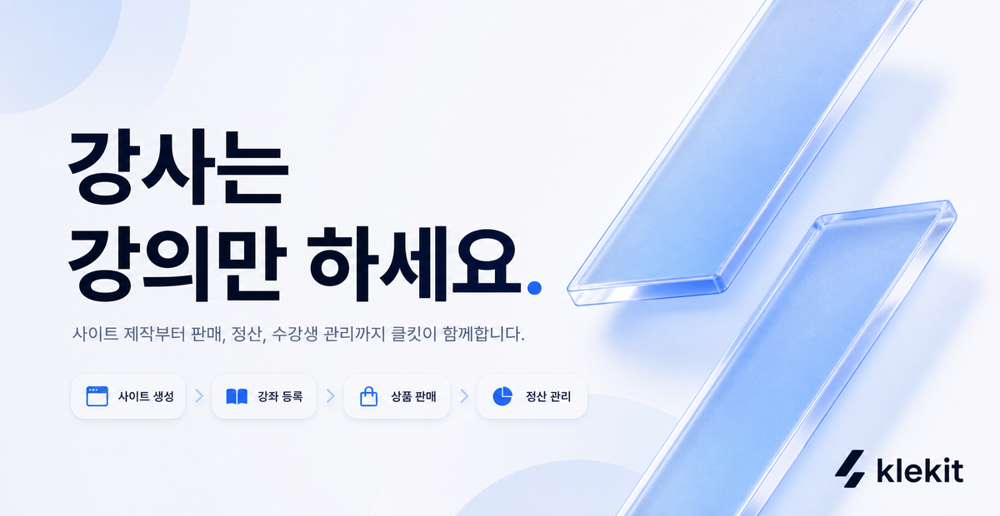
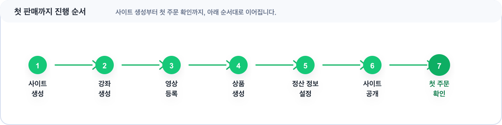

# 클킷 사용자 가이드

<figure><figcaption></figcaption></figure>

> 강사는 강의만 하세요.\
> 사이트 제작부터 판매, 정산, 수강생 관리까지 클킷이 함께합니다.

클킷은 강사가 온라인 강의를 판매하고 운영하는 데 필요한 흐름을 한곳에 모아둔 서비스입니다.\
처음이라면 아래 순서대로 따라가고, 이미 필요한 작업이 정해져 있다면 왼쪽 목차나 바로가기에서 원하는 문서로 이동해 주세요.


처음 시작하는 강사라면 **처음 판매까지 따라하기**부터 확인하는 것을 추천합니다. 사이트 생성부터 첫 주문 확인까지 한 번에 이어집니다.



[first-sales-guide.md](getting-started/first-sales-guide.md)


## 첫 판매 흐름

클킷에서 첫 판매까지 필요한 과정은 아래 순서로 진행됩니다.

<figure><figcaption></figcaption></figure>

각 단계는 처음부터 완벽하게 준비하지 않아도 괜찮습니다. 먼저 판매 가능한 최소 흐름을 완성한 뒤, 강좌 설명과 사이트 디자인을 조금씩 다듬어도 됩니다.

## 가이드 바로가기

찾으시는 내용이 있나요? 클릭하시면 관련 문서로 이동합니다.

|                                                                                         |                                                                                                   |                                                                                                 |
| --------------------------------------------------------------------------------------- | ------------------------------------------------------------------------------------------------- | ----------------------------------------------------------------------------------------------- |
|   |              |  |
|  |  |         |


강좌, 상품, 수강권의 관계가 헷갈린다면 [강좌와 상품 만들기](course-product/create-courses-and-products.md)를 먼저 확인해 주세요.


## 클킷 센터

서비스 이용 중 도움이 필요하다면 고객지원으로 문의해 주세요.

| 구분     | 안내                 |
| ------ | ------------------ |
| 이메일 문의 | support@klekit.io  |
| 채널톡 문의 | 사이트 하단 채널톡         |
| 운영 시간  | 평일 오전 10시 \~ 오후 7시 |


강좌 생성, 상품 설정, 결제·정산 준비 중 막히는 부분이 있다면 현재 진행 중인 화면과 함께 문의해 주세요. 더 빠르게 확인할 수 있습니다.

