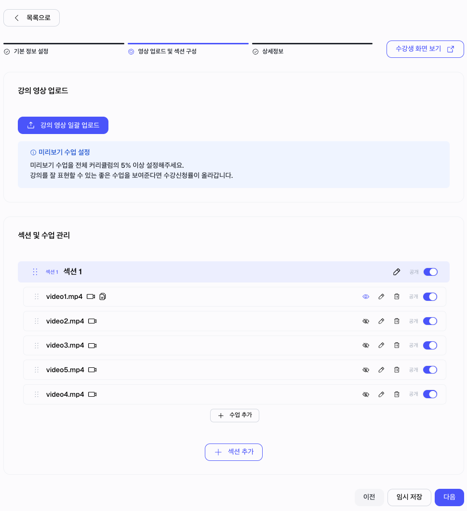
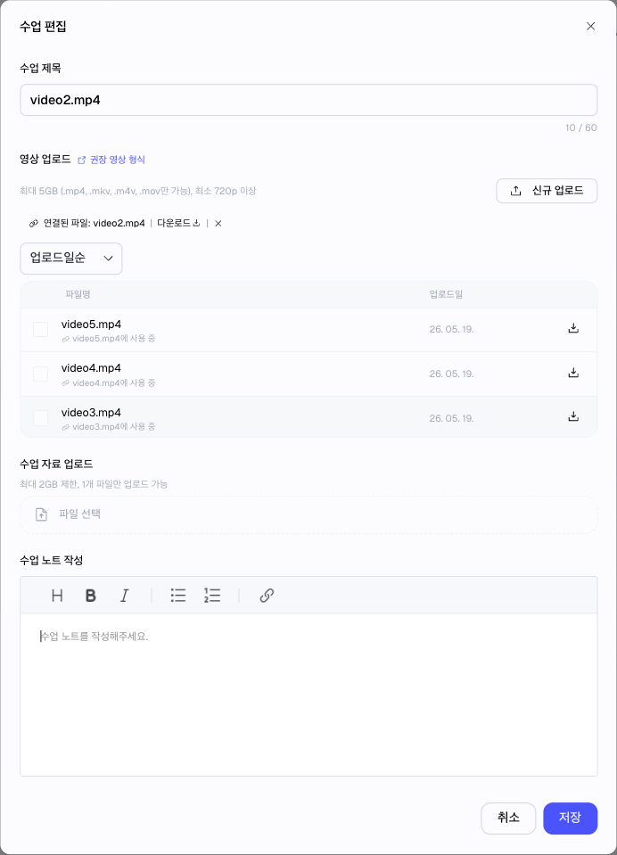
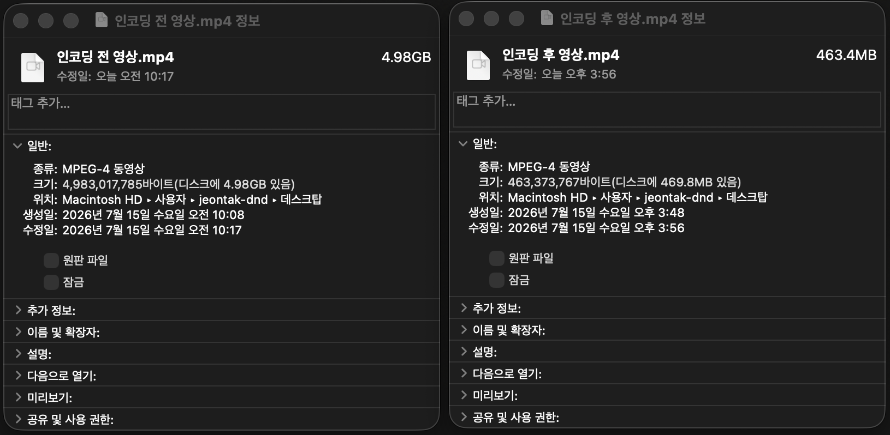
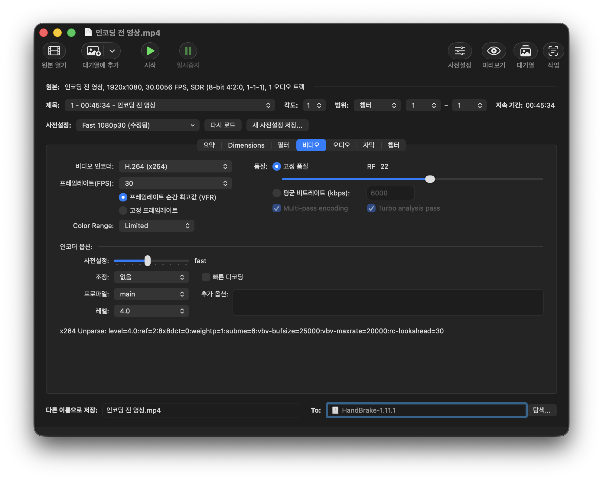
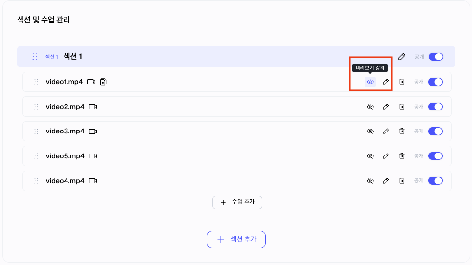

# 커리큘럼·영상 업로드 가이드

> 섹션과 강의를 만들고, 각 강의에 영상을 연결합니다.


커리큘럼은 수강생이 학습하는 순서입니다. 섹션은 강의를 묶는 단위이고, 강의는 수강생이 실제로 보는 학습 단위입니다.


## 이런 경우에 보세요

| 상황                   | 이 문서에서 확인할 내용 |
| -------------------- | ------------- |
| 강좌 안에 강의를 등록하고 싶습니다. | 섹션과 강의 구성 순서  |
| 섹션과 강의의 차이가 궁금합니다.   | 커리큘럼 구조       |
| 강의 영상을 업로드하고 싶습니다.   | 영상 연결 후 확인 기준 |
| 미리보기 강의를 설정하고 싶습니다.  | 미리보기 추천 기준    |

## 한눈에 보기

<figure><figcaption></figcaption></figure>

## 섹션과 강의 차이

| 구분 | 의미                | 예시                       |
| -- | ----------------- | ------------------------ |
| 섹션 | 강의를 묶는 단위         | 핵심 개념, 문제 풀이             |
| 강의 | 수강생이 실제로 보는 학습 단위 | 일차방정식 기본 개념, 대표 유형 1번 풀이 |

예시:

| 섹션     | 강의 예시      |
| ------ | ---------- |
| 오리엔테이션 | 강좌 소개      |
| 핵심 개념  | 개념 1, 개념 2 |

## 1. 커리큘럼 구조 잡기

처음에는 섹션을 너무 많이 만들 필요가 없습니다.

<figure><figcaption>
섹션을 만들고 그 안에 수업을 추가해 수강생이 따라갈 학습 순서를 구성합니다.
</figcaption></figure>

추천 구조:

| 추천 섹션  | 역할              |
| ------ | --------------- |
| 오리엔테이션 | 강좌 소개와 학습 방법 안내 |
| 핵심 개념  | 주요 개념 설명        |
| 문제 풀이  | 대표 유형과 실전 문제 풀이 |
| 마무리    | 복습과 다음 학습 안내    |

강좌가 커지면 섹션을 더 세분화하면 됩니다.

## 2. 강의 제목 작성하기

강의 제목은 수강생이 학습 순서를 이해할 수 있도록 작성합니다.

| 좋은 예         | 아쉬운 예 |
| ------------ | ----- |
| 강좌 소개와 학습 방법 | 1강    |
| 일차방정식 기본 개념  | 개념    |
| 대표 유형 1번 풀이  | 문제    |
| 자주 틀리는 문제 정리 | 정리    |

## 3. 영상 업로드하기

각 강의에 영상을 업로드합니다.

<figure><figcaption>
수업 편집 화면에서 영상을 새로 업로드하거나 기존 업로드 파일을 연결할 수 있습니다.
</figcaption></figure>

업로드 가능한 영상 파일:

| 항목       | 기준                           |
| -------- | ---------------------------- |
| 권장 형식    | mp4                          |
| 지원 확장자   | mp4, mov, m4v, webm, mkv     |
| 미지원 확장자  | avi, wmv, flv, 3gp           |
| 최대 용량    | 파일당 5GB                      |
| 권장 해상도   | 1080p, 1920x1080              |
| 권장 화면 비율 | 16:9                         |
| 휴대폰 촬영   | 안드로이드 mp4, 아이폰 mov 업로드 가능 |


아이폰 기본 촬영 영상은 보통 mov 형식이고, 안드로이드 기본 촬영 영상은 보통 mp4 형식입니다. 두 형식 모두 업로드할 수 있습니다.



5GB에 가까운 영상은 업로드 시간이 오래 걸리고 네트워크 상태에 따라 실패할 수 있습니다. 큰 파일은 안정적인 인터넷 환경에서 하나씩 업로드해 주세요.


### 영상 용량 줄이기

휴대폰으로 촬영한 영상은 길이에 비해 용량이 클 수 있습니다. 업로드가 오래 걸리거나 실패한다면 업로드 전에 영상 용량을 줄여 주세요.

촬영 전 권장 설정:

| 항목    | 권장 설정              |
| ----- | ------------------ |
| 해상도   | 1080p              |
| 프레임   | 30fps              |
| 화면 비율 | 16:9               |
| 파일 형식 | mp4 권장             |
| 촬영 방향 | 가로 촬영 권장           |
| 오디오   | 말소리가 또렷하게 들리는지 확인 |

피하는 것이 좋은 설정:

| 설정      | 이유                  |
| ------- | ------------------- |
| 4K 촬영   | 파일 용량이 크게 늘어납니다.    |
| 60fps   | 일반 강의 영상에는 대부분 불필요합니다. |
| 너무 긴 단일 영상 | 업로드 시간이 길어지고 실패 위험이 커집니다. |

용량이 너무 클 때:

| 방법       | 설명                              |
| -------- | ------------------------------- |
| 영상을 나누기  | 긴 수업 영상은 단원이나 시간 기준으로 나눠 업로드합니다. |
| 해상도 낮추기  | 4K 영상은 1080p로 변환해 업로드합니다.       |
| mp4로 변환하기 | mov 파일 용량이 크다면 mp4로 변환할 수 있습니다. |
| 다시 내보내기  | 편집 프로그램에서 H.264, 1080p 기준으로 내보냅니다. |

<figure><figcaption>
같은 영상도 인코딩 후 파일 용량이 크게 줄어들 수 있습니다. 용량이 작아지면 업로드 시간이 줄고 실패 가능성도 낮아집니다.
</figcaption></figure>

인코딩 권장값:

| 항목    | 권장값           |
| ----- | ------------- |
| 형식    | mp4           |
| 비디오 코덱 | H.264         |
| 해상도   | 1920x1080     |
| 프레임   | 30fps         |
| 오디오   | AAC, 44.1kHz 이상 |

<figure><figcaption>
영상 용량이 큰 경우 HandBrake에서 H.264, 1080p, 30fps 기준으로 다시 내보내면 업로드 실패 가능성을 줄일 수 있습니다.
</figcaption></figure>


영상 용량을 줄일 때 가장 중요한 것은 학생이 칠판 글씨와 강사 목소리를 충분히 확인할 수 있는지입니다. 화질을 낮춘 뒤에는 반드시 한 번 재생해 보고 글씨와 소리가 괜찮은지 확인해 주세요.


사용할 수 있는 도구:

| 도구        | 특징                         |
| --------- | -------------------------- |
| 휴대폰 기본 편집 | 짧게 자르거나 불필요한 앞뒤 부분을 제거하기 좋습니다. |
| CapCut    | 모바일에서 간단히 편집하고 다시 내보내기 좋습니다. |
| HandBrake | PC에서 영상 용량을 줄일 때 사용할 수 있습니다. |
| 샤나인코더    | Windows에서 영상 변환이 필요할 때 사용할 수 있습니다. |

확인할 것:

| 확인 항목  | 기준                       |
| ------ | ------------------------ |
| 업로드 상태 | 영상 업로드가 완료되었습니다.         |
| 강의 연결  | 강의 상세에서 영상이 연결되어 있습니다.   |
| 영상 길이  | 정상적으로 표시됩니다.             |
| 관리자 확인 | 관리자 화면에서 영상을 확인할 수 있습니다. |

## 4. 미리보기 강의 설정하기

미리보기 강의는 수강생이 구매 전 강좌 분위기를 확인할 수 있도록 공개하는 강의입니다.

<figure><figcaption>
눈 아이콘으로 구매 전 공개할 미리보기 강의를 설정합니다.
</figcaption></figure>

추천:

| 추천 영상                | 이유                      |
| -------------------- | ----------------------- |
| 강좌 소개 영상             | 구매 전 강좌 분위기를 파악하기 쉽습니다. |
| 첫 번째 핵심 개념 영상        | 실제 수업 방식을 보여줄 수 있습니다.   |
| 강좌의 장점을 잘 보여주는 짧은 영상 | 강좌 차별점을 빠르게 전달합니다.      |

주의할 점:

| 주의 항목    | 이유                                 |
| -------- | ---------------------------------- |
| 전체 공개 지양 | 모든 강의를 미리보기로 열 필요는 없습니다.           |
| 핵심 강의 보호 | 유료 콘텐츠의 핵심 강의를 과하게 공개하지 않도록 주의합니다. |

## 완료 후 확인

| 항목     | 확인                              |
| ------ | ------------------------------- |
| 영상 재생  | 관리자 화면에서 영상이 재생됩니다.             |
| 수강 권한  | 수강 권한이 없는 사용자가 유료 영상을 볼 수 없습니다. |
| 모바일 화면 | 모바일에서 재생 화면이 자연스럽습니다.           |
| 강의 순서  | 섹션과 강의 순서가 의도한 대로 보입니다.         |
| 미리보기   | 공개할 강의만 미리보기로 설정되어 있습니다.        |

## 자주 막히는 부분

| 상황                   | 확인할 것                                                                      |
| -------------------- | -------------------------------------------------------------------------- |
| 영상 업로드 후 바로 재생되지 않아요 | 영상 업로드나 처리 상태가 완료되지 않았을 수 있습니다. 잠시 후 다시 확인해 주세요.                           |
| 영상 업로드가 실패해요          | 지원 확장자와 파일 용량을 확인해 주세요. avi, wmv, flv, 3gp 파일은 업로드할 수 없고, 파일당 최대 용량은 5GB입니다. |
| 여러 영상을 올리다가 실패해요      | 업로드 URL이 만료되었을 수 있습니다. 다시 업로드를 시작해 주세요. 큰 파일은 하나씩 업로드하는 것을 권장합니다.             |
| 영상 용량이 너무 커요          | 4K나 60fps로 촬영했다면 1080p, 30fps 기준으로 다시 내보낸 뒤 업로드해 주세요.                         |
| 섹션 순서를 바꿀 수 있나요      | 가능합니다. 강좌 흐름에 맞게 섹션과 강의 순서를 조정할 수 있습니다.                                    |
| 강의마다 영상을 꼭 넣어야 하나요   | 영상 강좌라면 강의마다 영상을 연결하는 것이 좋습니다. 안내용 강의나 자료 중심 강의는 운영 방식에 따라 다르게 구성할 수 있습니다. |

## 다음에 보면 좋은 문서

| 문서                                           | 언제 보면 좋나요        |
| -------------------------------------------- | ---------------- |
| [수강 상품 생성 가이드](product-creation-guide.md)    | 커리큘럼을 상품으로 판매할 때 |
| [강좌와 상품 만들기](create-courses-and-products.md) | 강좌와 상품 관계가 헷갈릴 때 |
