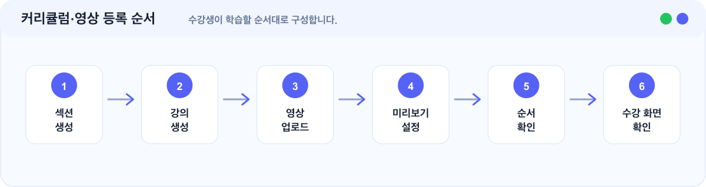

# 커리큘럼·영상 업로드 가이드

> 섹션과 강의를 만들고, 각 강의에 영상을 연결합니다.


커리큘럼은 수강생이 학습하는 순서입니다. 섹션은 강의를 묶는 단위이고, 강의는 수강생이 실제로 보는 학습 단위입니다.


## 이런 경우에 보세요

| 상황                   | 이 문서에서 확인할 내용 |
| -------------------- | ------------- |
| 강좌 안에 강의를 등록하고 싶습니다. | 섹션과 강의 구성 순서  |
| 섹션과 강의의 차이가 궁금합니다.   | 커리큘럼 구조       |
| 강의 영상을 업로드하고 싶습니다.   | 영상 연결 후 확인 기준 |
| 미리보기 강의를 설정하고 싶습니다.  | 미리보기 추천 기준    |

## 한눈에 보기

<figure><figcaption></figcaption></figure>

## 섹션과 강의 차이

| 구분 | 의미                | 예시                       |
| -- | ----------------- | ------------------------ |
| 섹션 | 강의를 묶는 단위         | 핵심 개념, 문제 풀이             |
| 강의 | 수강생이 실제로 보는 학습 단위 | 일차방정식 기본 개념, 대표 유형 1번 풀이 |

예시:

| 섹션     | 강의 예시      |
| ------ | ---------- |
| 오리엔테이션 | 강좌 소개      |
| 핵심 개념  | 개념 1, 개념 2 |

## 1. 커리큘럼 구조 잡기

처음에는 섹션을 너무 많이 만들 필요가 없습니다.

추천 구조:

| 추천 섹션  | 역할              |
| ------ | --------------- |
| 오리엔테이션 | 강좌 소개와 학습 방법 안내 |
| 핵심 개념  | 주요 개념 설명        |
| 문제 풀이  | 대표 유형과 실전 문제 풀이 |
| 마무리    | 복습과 다음 학습 안내    |

강좌가 커지면 섹션을 더 세분화하면 됩니다.

## 2. 강의 제목 작성하기

강의 제목은 수강생이 학습 순서를 이해할 수 있도록 작성합니다.

| 좋은 예         | 아쉬운 예 |
| ------------ | ----- |
| 강좌 소개와 학습 방법 | 1강    |
| 일차방정식 기본 개념  | 개념    |
| 대표 유형 1번 풀이  | 문제    |
| 자주 틀리는 문제 정리 | 정리    |

## 3. 영상 업로드하기

각 강의에 영상을 업로드합니다.

확인할 것:

| 확인 항목  | 기준                       |
| ------ | ------------------------ |
| 업로드 상태 | 영상 업로드가 완료되었습니다.         |
| 강의 연결  | 강의 상세에서 영상이 연결되어 있습니다.   |
| 영상 길이  | 정상적으로 표시됩니다.             |
| 관리자 확인 | 관리자 화면에서 영상을 확인할 수 있습니다. |

## 4. 미리보기 강의 설정하기

미리보기 강의는 수강생이 구매 전 강좌 분위기를 확인할 수 있도록 공개하는 강의입니다.

추천:

| 추천 영상                | 이유                      |
| -------------------- | ----------------------- |
| 강좌 소개 영상             | 구매 전 강좌 분위기를 파악하기 쉽습니다. |
| 첫 번째 핵심 개념 영상        | 실제 수업 방식을 보여줄 수 있습니다.   |
| 강좌의 장점을 잘 보여주는 짧은 영상 | 강좌 차별점을 빠르게 전달합니다.      |

주의할 점:

| 주의 항목    | 이유                                 |
| -------- | ---------------------------------- |
| 전체 공개 지양 | 모든 강의를 미리보기로 열 필요는 없습니다.           |
| 핵심 강의 보호 | 유료 콘텐츠의 핵심 강의를 과하게 공개하지 않도록 주의합니다. |

## 완료 후 확인

| 항목     | 확인                              |
| ------ | ------------------------------- |
| 영상 재생  | 관리자 화면에서 영상이 재생됩니다.             |
| 수강 권한  | 수강 권한이 없는 사용자가 유료 영상을 볼 수 없습니다. |
| 모바일 화면 | 모바일에서 재생 화면이 자연스럽습니다.           |
| 강의 순서  | 섹션과 강의 순서가 의도한 대로 보입니다.         |
| 미리보기   | 공개할 강의만 미리보기로 설정되어 있습니다.        |

## 자주 막히는 부분

| 상황                   | 확인할 것                                                                      |
| -------------------- | -------------------------------------------------------------------------- |
| 영상 업로드 후 바로 재생되지 않아요 | 영상 업로드나 처리 상태가 완료되지 않았을 수 있습니다. 잠시 후 다시 확인해 주세요.                           |
| 섹션 순서를 바꿀 수 있나요      | 가능합니다. 강좌 흐름에 맞게 섹션과 강의 순서를 조정할 수 있습니다.                                    |
| 강의마다 영상을 꼭 넣어야 하나요   | 영상 강좌라면 강의마다 영상을 연결하는 것이 좋습니다. 안내용 강의나 자료 중심 강의는 운영 방식에 따라 다르게 구성할 수 있습니다. |

## 다음에 보면 좋은 문서

| 문서                                           | 언제 보면 좋나요        |
| -------------------------------------------- | ---------------- |
| [수강 상품 생성 가이드](product-creation-guide.md)    | 커리큘럼을 상품으로 판매할 때 |
| [강좌와 상품 만들기](create-courses-and-products.md) | 강좌와 상품 관계가 헷갈릴 때 |
