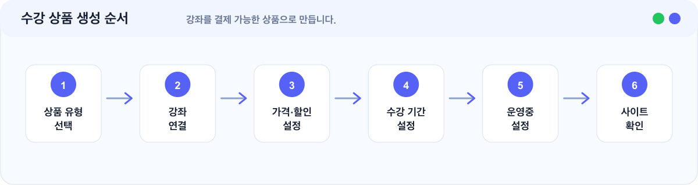
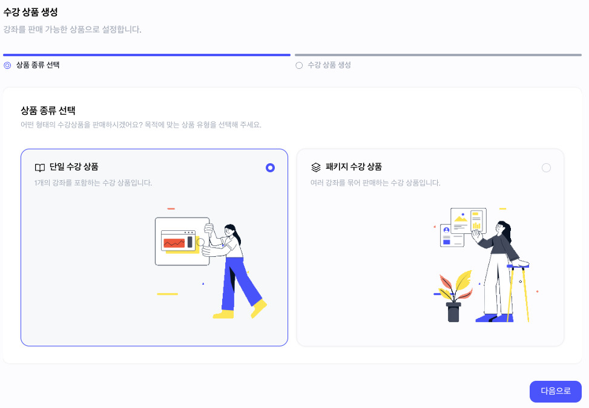
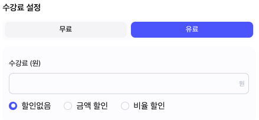
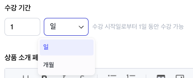
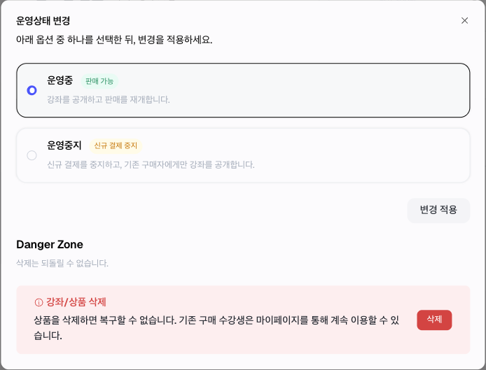

# 수강 상품 생성 가이드

> 강좌를 수강생이 결제할 수 있는 상품으로 만듭니다.


강좌만 만들면 판매가 시작되지 않습니다. 수강 상품을 만들고 강좌를 연결한 뒤 상품 상태를 운영중으로 설정해야 구매가 가능합니다.


## 이런 경우에 보세요

| 상황                           | 이 문서에서 확인할 내용       |
| ---------------------------- | ------------------- |
| 강좌를 판매하고 싶습니다.               | 상품 생성과 강좌 연결 순서     |
| 수강 기간과 가격을 설정하고 싶습니다.        | 가격, 할인, 수강 기간 입력 기준 |
| 단일 강좌 상품과 패키지 상품의 차이가 궁금합니다. | 상품 유형별 추천 상황        |
| 상품 운영중/운영중지 상태가 헷갈립니다.       | 상품 상태별 수강생 영향       |

## 한눈에 보기

<figure><figcaption></figcaption></figure>

## 상품 생성 전 준비

| 준비 항목  | 설명                     |
| ------ | ---------------------- |
| 판매할 강좌 | 상품에 연결할 강좌입니다.         |
| 상품명    | 수강생이 결제 화면에서 보는 이름입니다. |
| 상품 설명  | 상품 구성과 수강 조건을 설명합니다.   |
| 판매 금액  | 실제 판매 기준 금액입니다.        |
| 할인 정보  | 할인 금액 또는 할인율입니다.       |
| 수강 기간  | 결제 후 수강 가능한 기간입니다.     |
| 상품 썸네일 | 상품 목록에서 보이는 대표 이미지입니다. |

## 1. 상품 유형 선택하기

<figure><figcaption>
단일 수강 상품과 패키지 수강 상품 중 판매 방식에 맞는 상품 유형을 선택합니다.
</figcaption></figure>

| 상품 유형    | 설명                | 추천 상황              |
| -------- | ----------------- | ------------------ |
| 단일 강좌 상품 | 강좌 1개를 판매합니다.     | 첫 판매를 시작할 때        |
| 패키지 상품   | 여러 강좌를 묶어서 판매합니다. | 커리큘럼 묶음이나 심화 과정 판매 |

단일 강좌 상품 예시:

| 항목    | 예시            |
| ----- | ------------- |
| 상품명   | 중등 수학 90일 수강권 |
| 연결 강좌 | 중등 수학 개념 완성   |
| 수강 기간 | 90일           |
| 판매 금액 | 70,000원       |

패키지 상품 예시:

| 항목    | 예시                         |
| ----- | -------------------------- |
| 상품명   | 중등 수학 전체 패키지               |
| 연결 강좌 | 개념 강좌, 문제풀이 강좌, 실전 모의고사 강좌 |
| 수강 기간 | 180일                       |
| 판매 금액 | 180,000원                   |

## 2. 가격과 할인 설정하기

상품 가격은 수강생이 실제 결제하는 기준입니다.

<figure><figcaption>
무료/유료 여부와 할인 없음, 금액 할인, 비율 할인을 설정합니다.
</figcaption></figure>

확인할 것:

| 확인 항목    | 기준                   |
| -------- | -------------------- |
| 판매 금액    | 의도한 기준 금액과 맞습니다.     |
| 할인 정보    | 할인 금액 또는 할인율이 맞습니다.  |
| 최종 결제 금액 | 실제 결제 금액이 의도한 가격입니다. |

## 3. 수강 기간 설정하기

수강 기간은 수강생이 결제 후 강좌를 이용할 수 있는 기간입니다.

<figure><figcaption>
수강 시작일로부터 며칠 또는 몇 개월 동안 이용할 수 있는지 설정합니다.
</figcaption></figure>

예시:

| 수강 기간 예시 | 추천 상황      |
| -------- | ---------- |
| 30일      | 짧은 체험형 상품  |
| 60일      | 단기 완성형 강좌  |
| 90일      | 기본 판매 상품   |
| 180일     | 패키지나 장기 과정 |

수강 기간은 결제 후 생성되는 수강권의 만료일에 영향을 줍니다.

## 4. 상품 상태 설정하기

<figure><figcaption>
상품 운영 상태를 변경하거나 더 이상 판매하지 않을 상품을 삭제할 수 있습니다.
</figcaption></figure>

| 상태   | 의미                    | 수강생 영향                            |
| ---- | --------------------- | --------------------------------- |
| 운영중  | 수강생이 상품을 구매할 수 있습니다.  | 신규 구매 가능                          |
| 운영중지 | 신규 판매가 중단됩니다.         | 기존 구매 수강생은 수강 기간이 남아 있다면 계속 이용 가능 |
| 삭제   | 상품을 판매/관리 화면에서 정리합니다. | 기존 수강권은 바로 삭제되지 않음                |

## 완료 후 확인

| 항목    | 확인                 |
| ----- | ------------------ |
| 노출    | 상품이 수강생 사이트에 보입니다. |
| 연결 강좌 | 연결된 강좌가 맞습니다.      |
| 가격    | 가격과 할인 정보가 맞습니다.   |
| 기간    | 수강 기간이 맞습니다.       |
| 구매 버튼 | 구매 버튼이 정상 노출됩니다.   |

## 자주 막히는 부분

| 상황                           | 확인할 것                                                                  |
| ---------------------------- | ---------------------------------------------------------------------- |
| 상품을 만들었는데 구매 버튼이 안 보여요       | 상품 상태가 운영중인지, 사이트 운영 상태가 판매 가능한 상태인지 확인해 주세요.                          |
| 상품을 운영중지하면 기존 수강생도 수강할 수 없나요 | 아닙니다. 운영중지는 신규 판매를 중단하는 상태입니다. 기존 구매 수강생은 수강 기간이 남아 있다면 계속 수강할 수 있습니다. |
| 같은 강좌로 여러 상품을 만들 수 있나요       | 가능합니다. 같은 강좌를 30일 상품, 90일 상품처럼 여러 수강 기간으로 판매할 수 있습니다.                  |

## 다음에 보면 좋은 문서

| 문서                                                               | 언제 보면 좋나요             |
| ---------------------------------------------------------------- | --------------------- |
| [결제·정산 준비하기](../payments-settlements/payment-settlement-prep.md) | 판매 전 결제와 정산 구조를 확인할 때 |
| [주문과 수강생 관리 가이드](../operation/orders-students-management.md)     | 결제 후 주문과 수강권을 확인할 때   |
