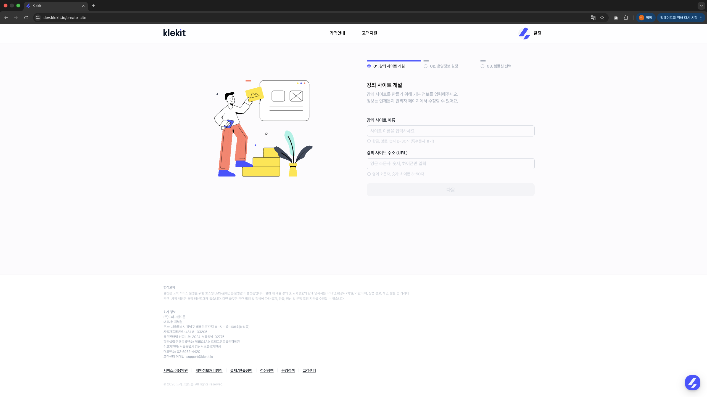
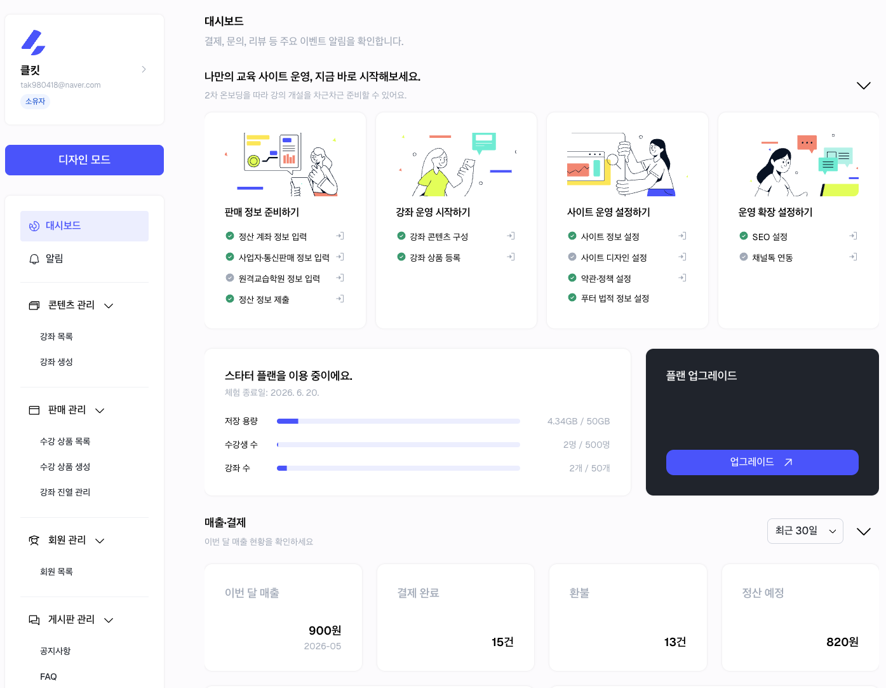
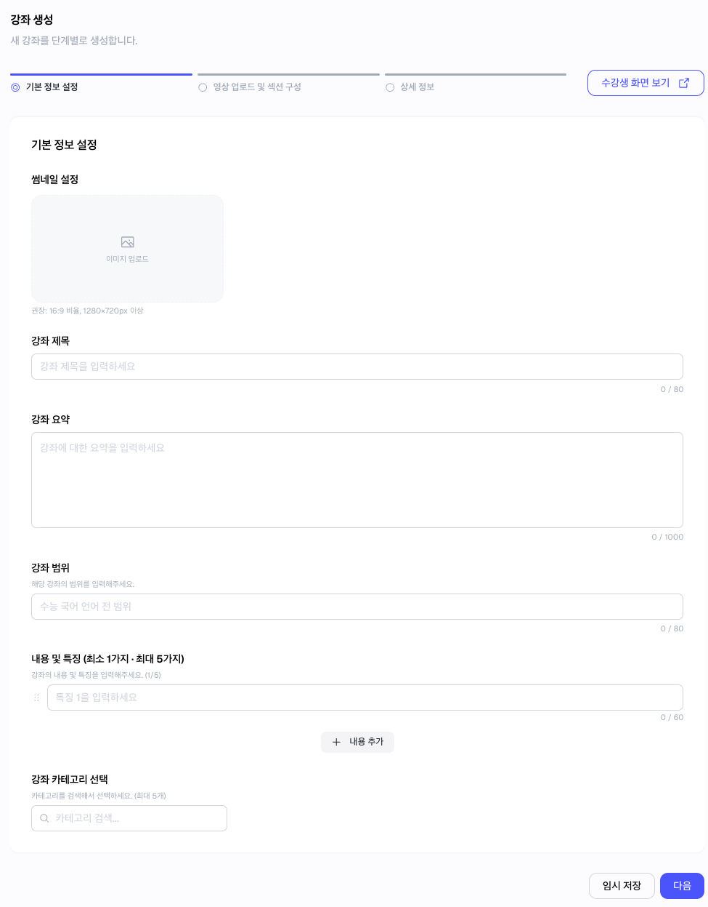
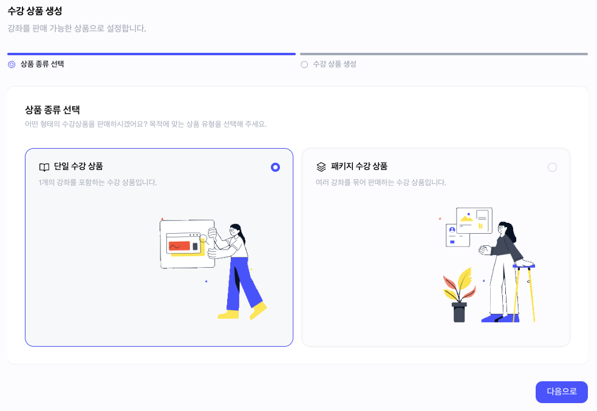
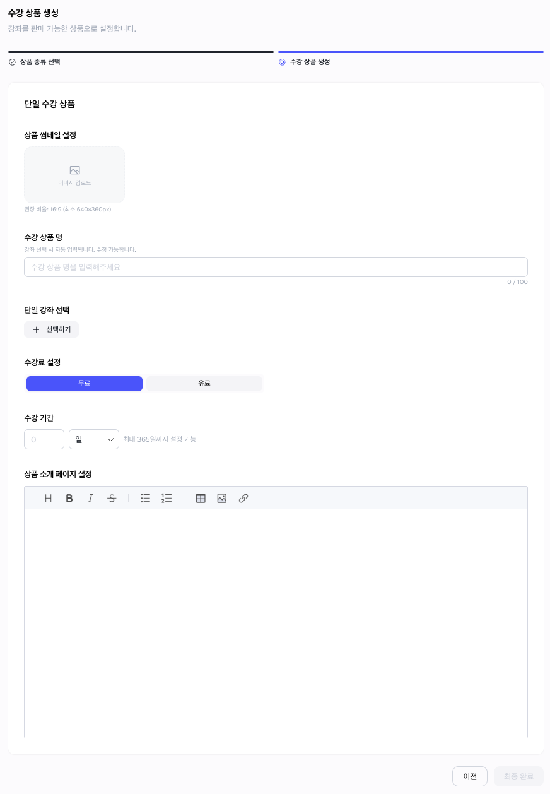
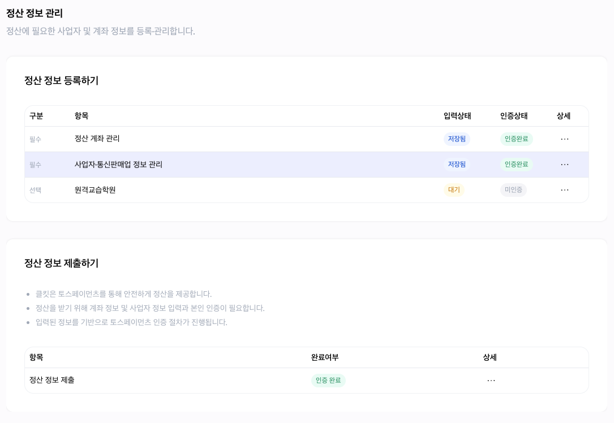
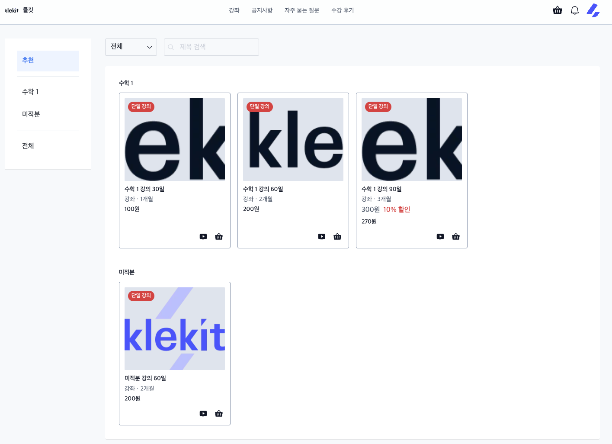
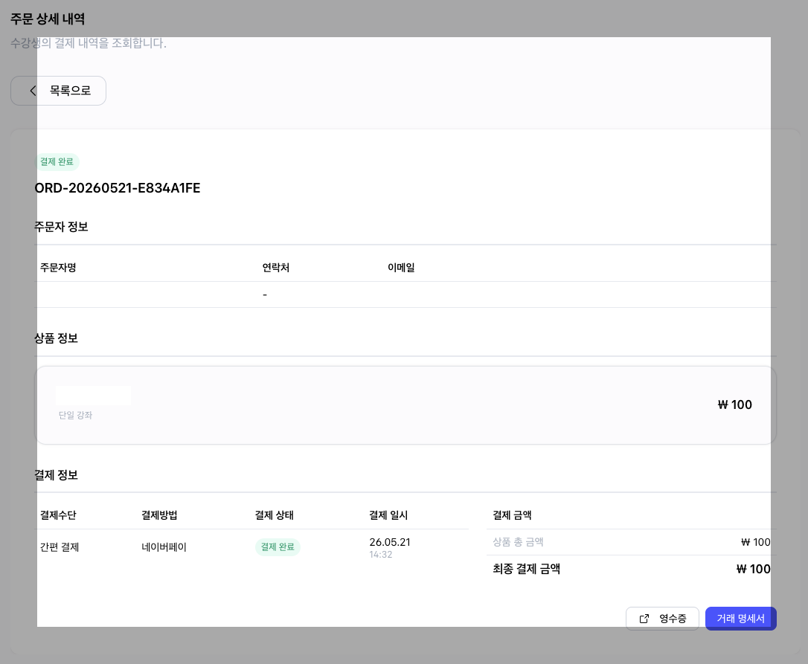

# 처음 판매까지 따라하기

> 사이트 생성부터 첫 주문 확인까지, 처음 판매에 필요한 최소 흐름을 한 번에 따라갑니다.


처음부터 모든 설정을 완벽하게 채우지 않아도 괜찮습니다. 먼저 판매 가능한 최소 흐름을 완성한 뒤, 강좌 설명과 사이트 디자인을 조금씩 다듬어 주세요.


## 이런 경우에 보세요 <a href="#id-1" id="id-1"></a>

| 상황                            | 이 문서에서 확인할 내용            |
| ----------------------------- | ------------------------ |
| 클킷을 처음 사용합니다.                 | 사이트 생성부터 첫 주문 확인까지 전체 흐름 |
| 무료체험 기간 동안 무엇을 해야 할지 모르겠습니다.  | 무료체험 중 우선 준비할 항목         |
| 강좌는 있지만 결제와 수강생 관리 구조가 필요합니다. | 상품, 정산, 주문 확인 흐름         |
| 첫 판매 전 꼭 확인해야 할 순서를 알고 싶습니다.  | 판매 전 최종 점검 기준            |

## 한눈에 보기 <a href="#id-2" id="id-2"></a>

<figure><figcaption></figcaption></figure>

## 시작 전 준비 <a href="#id-3" id="id-3"></a>

아래 자료가 있으면 첫 설정이 더 빠릅니다. 없어도 시작할 수 있고, 부족한 내용은 나중에 수정할 수 있습니다.

| 준비 항목   | 예시                |
| ------- | ----------------- |
| 강좌명     | 중등 수학 1학기 개념 완성   |
| 강좌 소개   | 어떤 학생에게 필요한 강좌인지  |
| 썸네일 이미지 | 강좌 목록에 노출될 대표 이미지 |
| 강의 영상   | 업로드할 수업 영상        |
| 판매 정보   | 가격, 수강 기간, 할인     |
| 정산 정보   | 계좌, 사업자 정보        |
| 사이트 정보  | 로고, 사이트 소개, 약관·정책 |

## 1. 회원가입하기

클킷 계정을 생성한 뒤 플랫폼에 로그인합니다.

확인할 것:

| 확인 항목 | 기준                               |
| ----- | -------------------------------- |
| 로그인   | 이메일 또는 소셜 계정으로 로그인할 수 있습니다.      |
| 다음 화면 | 로그인 후 내 사이트를 만들 수 있는 화면으로 이동합니다. |

## 2. 내 강의 사이트 만들기

사이트 이름과 주소를 입력해 첫 강의 사이트를 만듭니다.

<figure><figcaption><p>사이트 이름과 주소를 입력해 첫 강의 사이트를 만듭니다.</p></figcaption></figure>

예시:

| 항목     | 예시            |
| ------ | ------------- |
| 사이트 이름 | 전탁수학          |
| 사이트 주소 | `jeontakmath` |

확인할 것:

| 확인 항목   | 기준                    |
| ------- | --------------------- |
| 중복 여부   | 사이트 주소가 중복되지 않습니다.    |
| 기억하기 쉬움 | 강사가 기억하기 쉽습니다.        |
| 공유 적합성  | 수강생에게 공유해도 어색하지 않습니다. |

## 3. 사이트 기본 정보 설정하기

관리자 화면에서 사이트의 기본 운영 정보를 입력합니다.

<figure><figcaption><p>대시보드에서 사이트 운영에 필요한 기본 설정을 확인합니다.</p></figcaption></figure>

처음에는 아래 항목을 우선 입력합니다.

| 우선 입력 항목     | 용도                  |
| ------------ | ------------------- |
| 사이트 이름       | 수강생에게 보이는 사이트명      |
| 사이트 소개       | 사이트의 방향과 강의 주제 설명   |
| 로고 또는 대표 이미지 | 브랜드 첫인상             |
| SEO 제목과 설명   | 검색과 공유 미리보기 기본 정보   |
| OG 이미지       | 링크 공유 시 노출되는 대표 이미지 |
| 약관·정책 정보     | 판매와 운영에 필요한 정책 정보   |


사이트 디자인은 처음 판매 준비가 끝난 뒤 다듬어도 됩니다. 먼저 수강생이 강좌를 보고 결제할 수 있는 흐름을 만드는 것이 중요합니다.


## 4. 강좌 만들기

판매할 첫 강좌를 만듭니다.

<figure><figcaption><p>강좌 제목, 요약, 썸네일 등 수강생이 먼저 보는 정보를 입력합니다.</p></figcaption></figure>

입력할 정보:

| 입력 정보   | 용도               |
| ------- | ---------------- |
| 강좌 제목   | 수강생이 가장 먼저 보는 이름 |
| 강좌 썸네일  | 목록과 상세 화면 대표 이미지 |
| 강좌 범위   | 수강 대상과 학습 범위     |
| 내용 및 특징 | 강좌의 강점과 수업 방식    |
| 강좌 요약   | 구매 전 빠르게 읽는 설명   |

좋은 제목 예시:

| 좋은 예                | 이유                |
| ------------------- | ----------------- |
| 중등 수학 1학기 개념 완성     | 대상과 결과가 분명합니다.    |
| 고등 수학 상 대표 유형 문제 풀이 | 과목과 수업 방식이 보입니다.  |
| 초등 5학년 연산 실수 줄이기    | 수강 후 기대 효과가 보입니다. |

자세한 내용은 [강좌 생성 가이드](../course-product/course-creation-guide.md)를 확인해 주세요.

## 5. 커리큘럼과 영상 등록하기

강좌 안에 섹션과 강의를 등록하고, 각 강의에 영상을 연결합니다.

추천 시작 구조:

| 섹션     | 강의 예시              |
| ------ | ------------------ |
| 오리엔테이션 | 강좌 소개              |
| 핵심 개념  | 개념 1, 개념 2         |
| 문제 풀이  | 대표 유형 풀이, 실전 문제 풀이 |

완료 후 확인:

| 확인 항목  | 기준                     |
| ------ | ---------------------- |
| 섹션 순서  | 수강 흐름과 맞습니다.           |
| 강의 제목  | 제목만 봐도 내용을 예상할 수 있습니다. |
| 영상 업로드 | 업로드가 완료되었습니다.          |
| 영상 재생  | 강의 상세에서 영상이 재생됩니다.     |

자세한 내용은 [커리큘럼·영상 업로드 가이드](../course-product/curriculum-and-video-upload.md)를 확인해 주세요.

## 6. 수강 상품 만들기

수강생이 실제로 구매할 상품을 만듭니다. 강좌만 만들면 판매가 시작되지 않습니다.

<figure><figcaption><p>단일 강좌 상품 또는 패키지 상품 중 판매 방식에 맞는 상품 유형을 선택합니다.</p></figcaption></figure>

| 상품 유형    | 언제 사용하나요                          |
| -------- | --------------------------------- |
| 단일 강좌 상품 | 강좌 1개를 판매할 때 사용합니다. 처음 판매에 추천합니다. |
| 패키지 상품   | 여러 강좌를 묶어 판매할 때 사용합니다.            |

입력할 정보:

<figure><figcaption><p>상품명, 연결 강좌, 수강 기간, 소개 내용을 입력해 구매 가능한 상품을 만듭니다.</p></figcaption></figure>

| 입력 정보 | 용도              |
| ----- | --------------- |
| 상품명   | 결제 화면에 노출되는 이름  |
| 상품 설명 | 상품 구성과 수강 조건 설명 |
| 연결 강좌 | 구매 시 지급할 강좌     |
| 판매 금액 | 결제 기준 금액        |
| 할인 정보 | 할인 금액 또는 할인율    |
| 수강 기간 | 결제 후 이용 가능 기간   |
| 운영 상태 | 구매 가능 여부        |

자세한 내용은 [수강 상품 생성 가이드](../course-product/product-creation-guide.md)를 확인해 주세요.

## 7. 정산 정보 설정하기

강의 판매 금액을 정산받기 위한 정보를 입력합니다.

<figure><figcaption><p>정산 계좌, 사업자 정보, 통신판매업 정보 등 판매 정산에 필요한 정보를 등록합니다.</p></figcaption></figure>

필요할 수 있는 정보:

| 정보           | 용도           |
| ------------ | ------------ |
| 정산 담당자 정보    | 정산 관련 안내 수신  |
| 정산 계좌 정보     | 판매 금액 지급     |
| 사업자 정보       | 판매자 식별       |
| 통신판매업 신고 정보  | 온라인 판매 운영 확인 |
| 원격교습학원 관련 정보 | 교육 콘텐츠 운영 확인 |

자세한 내용은 [정산 정보 설정 가이드](../payments-settlements/settlement-info-settings.md)를 확인해 주세요.

## 8. 사이트 화면 확인하기

수강생이 보게 될 사이트 화면을 확인합니다.

<figure><figcaption><p>수강생이 처음 보는 메인 화면에서 강좌와 사이트 분위기를 확인합니다.</p></figcaption></figure>

<figure><figcaption><p>강좌 목록에서 상품 카드, 가격, 구매 동선이 자연스럽게 보이는지 확인합니다.</p></figcaption></figure>

완료 후 확인:

| 확인 항목  | 기준                       |
| ------ | ------------------------ |
| 메인 화면  | 강좌와 상품이 자연스럽게 보입니다.      |
| 구매 버튼  | 찾기 쉽습니다.                 |
| 모바일 화면 | 이미지와 텍스트가 잘리지 않습니다.      |
| 브랜딩    | 사이트 이름과 로고가 신뢰감 있게 보입니다. |

## 9. 사이트 공개 전 최종 점검하기

판매를 시작하기 전 아래 항목을 확인합니다.

| 항목       | 확인                      |
| -------- | ----------------------- |
| 강좌 기본 정보 | 제목, 썸네일, 요약이 입력되어 있습니다. |
| 커리큘럼     | 섹션, 강의, 영상이 연결되어 있습니다.  |
| 수강 상품    | 상품이 운영중 상태입니다.          |
| 가격·기간    | 가격, 할인, 수강 기간이 맞습니다.    |
| 정산 정보    | 정산에 필요한 정보가 입력되어 있습니다.  |
| 약관·정책    | 약관·정책 설정이 완료되어 있습니다.    |
| 수강생 사이트  | 상품 구매 화면이 보입니다.         |

## 10. 판매 시작하기

사이트와 상품 상태를 확인한 뒤 수강생에게 사이트 주소를 공유합니다.

공유 문구 예시:

```
중등 수학 1학기 개념 완성 강좌를 오픈했습니다.
아래 사이트에서 강좌 소개와 수강 신청을 확인할 수 있습니다.

사이트 주소: https://example.klekit.site
문의: 사이트 내 1:1 문의 또는 채널톡
```

## 11. 첫 주문과 수강생 확인하기

수강생이 결제하면 관리자 화면에서 주문과 수강생 상태를 확인합니다.

<figure><figcaption><p>첫 주문이 들어오면 주문자, 상품, 결제 금액, 결제 상태를 확인합니다.</p></figcaption></figure>

완료 후 확인:

| 확인 항목  | 기준                    |
| ------ | --------------------- |
| 주문 내역  | 결제 건이 표시됩니다.          |
| 수강생 목록 | 구매자가 표시됩니다.           |
| 수강권 상태 | `ACTIVE`로 생성되었습니다.    |
| 만료일    | 상품 설정과 일치합니다.         |
| 강의실 입장 | 수강생 사이트에서 입장할 수 있습니다. |

자세한 내용은 [주문과 수강생 관리 가이드](../operation/orders-students-management.md)를 확인해 주세요.

## 자주 막히는 부분

| 상황                     | 확인할 것                                                  |
| ---------------------- | ------------------------------------------------------ |
| 강좌를 만들었는데 사이트에 보이지 않아요 | 수강 상품을 만들고 강좌를 연결했는지, 상품 상태가 운영중인지 확인해 주세요.            |
| 상품을 만들었는데 구매할 수 없어요    | 상품 상태, 사이트 운영 상태, 구독 상태, 정산 정보 설정 여부를 확인해 주세요.         |
| 영상이 바로 재생되지 않아요        | 영상 업로드나 처리 상태가 완료되지 않았을 수 있습니다. 잠시 후 다시 확인해 주세요.       |
| 무료체험이 끝나면 사이트가 사라지나요   | 바로 삭제되지 않습니다. 구독 만료 상태로 전환되며, 플랜을 선택하면 이어서 운영할 수 있습니다. |
| 상품을 삭제하면 기존 수강생도 못 보나요 | 기존 구매 수강생은 수강권과 수강 기간을 기준으로 이용 가능 여부가 결정됩니다.           |

## 다음에 보면 좋은 문서

| 문서                                                               | 언제 보면 좋나요               |
| ---------------------------------------------------------------- | ----------------------- |
| [강좌와 상품 만들기](../course-product/create-courses-and-products.md)   | 강좌와 상품의 차이가 헷갈릴 때       |
| [결제·정산 준비하기](../payments-settlements/payment-settlement-prep.md) | 판매 전 결제와 정산 구조를 확인할 때   |
| [사이트 운영 상태 가이드](../operation/site-operation-status.md)           | 운영중, 운영중지, 만료 상태를 확인할 때 |
