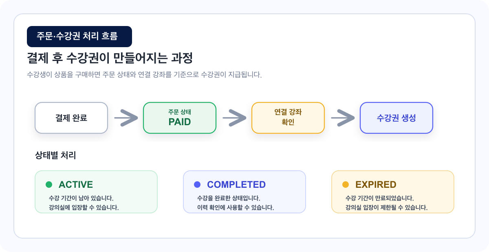

# 주문과 수강생 관리 가이드

수강생이 상품을 구매하면 주문 내역이 생성되고, 상품에 연결된 강좌의 수강권이 지급됩니다.

<figure><figcaption></figcaption></figure>

## 이런 경우에 보세요

| 상황                                                | 보면 좋은 부분       |
| ------------------------------------------------- | -------------- |
| 수강생이 결제했는지 확인하고 싶습니다.                             | 주문 확인하기        |
| 수강권이 제대로 지급되었는지 확인하고 싶습니다.                        | 결제 후 수강권 지급 흐름 |
| 수강생 목록과 상세 정보를 보고 싶습니다.                           | 수강생 확인하기       |
| 수강 상태가 ACTIVE, COMPLETED, EXPIRED로 나오는 이유가 궁금합니다. | 수강권 상태 이해하기    |

## 주문 확인하기

주문 내역에서는 수강생의 결제 정보를 확인할 수 있습니다.

| 확인 항목 | 의미                       |
| ----- | ------------------------ |
| 주문자   | 결제를 진행한 수강생              |
| 상품명   | 수강생이 구매한 수강 상품           |
| 결제 금액 | 실제 결제된 금액                |
| 결제 상태 | 결제 완료, 취소, 환불 등 주문 처리 상태 |
| 결제 일시 | 결제가 완료된 시점               |
| 환불 여부 | 환불 요청 또는 환불 완료 여부        |

## 수강생 확인하기

수강생 목록에서는 강좌를 수강 중인 사용자를 확인할 수 있습니다.

| 확인 항목    | 의미                         |
| -------- | -------------------------- |
| 수강생 이름   | 수강권을 가진 사용자                |
| 이메일      | 수강생 계정 식별 정보               |
| 수강 중인 강좌 | 수강권이 연결된 강좌                |
| 수강권 상태   | ACTIVE, COMPLETED, EXPIRED |
| 수강 시작일   | 수강권이 시작된 날짜                |
| 수강 만료일   | 수강 가능한 마지막 날짜              |
| 진도율      | 강의를 어느 정도 수강했는지            |

## 수강권 상태 이해하기

| 상태        | 의미                     | 수강생 화면       |
| --------- | ---------------------- | ------------ |
| ACTIVE    | 수강 기간이 남아 있고 수강 가능한 상태 | 강의실 입장 가능    |
| COMPLETED | 수강을 완료한 상태             | 이력 확인 가능     |
| EXPIRED   | 수강 기간이 만료된 상태          | 강의실 입장 제한 가능 |


만료된 수강권은 수강생의 이력에는 남을 수 있지만, 강의실 입장은 제한될 수 있습니다.


## 결제 후 수강권 지급 흐름

| 순서 | 처리 내용           |
| -- | --------------- |
| 1  | 수강생 결제 완료       |
| 2  | 주문 상태가 PAID로 변경 |
| 3  | 상품에 연결된 강좌 확인   |
| 4  | 강좌별 수강권 생성      |
| 5  | 수강생 내 학습 화면에 표시 |

## 관리자/강사의 강좌 접근

관리자와 강사는 운영 확인을 위해 전체 강좌에 접근할 수 있습니다.

이 접근 권한은 일반 수강생의 구매 수강권과 구분됩니다.


관리자와 강사의 접근 권한은 운영 확인용입니다. 일반 수강생의 구매, 정산, 환불 판단과는 분리해서 봅니다.


## 자주 막히는 부분

### 수강생이 결제했는데 강좌가 안 보인다고 해요.

주문 상태, 수강권 상태, 상품과 강좌 연결 상태를 확인해 주세요.

### 만료된 수강권도 목록에 보이나요?

만료된 수강권은 이력 확인을 위해 목록에 보일 수 있습니다. 다만 강의실 입장은 제한될 수 있습니다.

### 관리자가 수강생 사이트에서 모든 강좌를 볼 수 있나요?

운영 확인 목적상 관리자와 강사는 전체 강좌에 접근할 수 있습니다. 일반 수강생의 구매 권한과는 별도로 관리됩니다.
