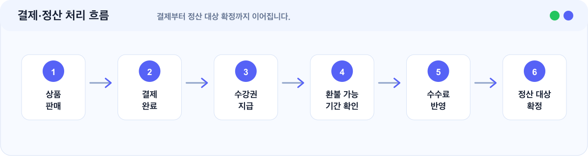

# 결제·정산 준비하기

클킷에서는 별도 PG 계약 없이 강의 판매를 시작할 수 있습니다.

다만 실제 판매와 정산을 위해서는 정산 정보와 운영 정보를 정확히 입력해야 합니다.

## 이런 경우에 보세요

| 상황                             | 이 문서에서 확인할 내용  |
| ------------------------------ | -------------- |
| 강의를 판매하기 전 무엇을 준비해야 하는지 궁금합니다. | 결제와 정산 준비 항목   |
| 별도 PG 계약이 필요한지 알고 싶습니다.        | 클킷 결제 지원 방식    |
| 정산 정보를 어디까지 입력해야 하는지 궁금합니다.    | 판매 전 입력할 정보    |
| 수수료와 정산 기준을 이해하고 싶습니다.         | 정산 금액에 반영되는 요소 |

## 결제는 어떻게 진행되나요?

수강생이 상품을 구매하면 클킷 결제 시스템을 통해 결제가 진행됩니다.

결제가 완료되면 상품에 연결된 강좌의 수강권이 자동으로 지급됩니다.

기본 흐름:

<figure><figcaption></figcaption></figure>

## 별도 PG 계약이 필요한가요?

아니요. 클킷에서 결제와 정산 흐름을 함께 지원하므로 별도 PG 계약 없이 판매를 시작할 수 있습니다.

## 판매 전 입력해야 하는 정보

정산을 위해 아래 정보가 필요할 수 있습니다.

| 정보           | 용도           |
| ------------ | ------------ |
| 정산 담당자 정보    | 정산 관련 안내 수신  |
| 정산 계좌 정보     | 판매 금액 지급     |
| 사업자 정보       | 판매자 식별       |
| 통신판매업 신고 정보  | 온라인 판매 운영 확인 |
| 원격교습학원 관련 정보 | 교육 콘텐츠 운영 확인 |

입력이 필요한 항목은 관리자 설정 화면에서 안내됩니다.

자세한 입력 방법은 [정산 정보 설정 가이드](settlement-info-settings.md)를 확인해 주세요.

## 정산은 언제 진행되나요?

정산은 월 단위로 진행됩니다.

환불 가능 기간이 지난 결제 건을 기준으로 PG 수수료와 플랫폼 정책에 따른 수수료를 반영해 지급됩니다.

## 수수료는 어떻게 계산되나요?

실제 정산 금액은 아래 요소를 반영해 계산됩니다.

| 반영 요소       | 의미              |
| ----------- | --------------- |
| 결제 금액       | 수강생이 결제한 금액     |
| PG 수수료      | 결제 처리에 필요한 수수료  |
| 플랫폼 수수료     | 플랫폼 정책에 따른 수수료  |
| 환불 여부       | 환불된 결제 건인지 여부   |
| 정산 제외 대상 여부 | 정산 대상에서 제외되는 조건 |

정확한 정산 금액은 관리자 정산 화면에서 확인할 수 있도록 구성됩니다.

## 환불과 정산은 어떤 관계가 있나요?

환불 가능성이 남아 있는 결제 건은 바로 정산되지 않을 수 있습니다.

환불 가능 기간이 지나고, 환불 처리가 완료된 건을 기준으로 정산 대상이 결정됩니다.

## 판매 전 체크리스트

판매를 시작하기 전 아래 항목을 확인해 주세요.

| 확인 항목  | 기준                     |
| ------ | ---------------------- |
| 수강 상품  | 운영중 상태입니다.             |
| 가격과 기간 | 상품 가격과 수강 기간이 맞습니다.    |
| 정산 계좌  | 정산 계좌 정보가 입력되어 있습니다.   |
| 사업자 정보 | 필요한 사업자 정보가 입력되어 있습니다. |
| 약관·정책  | 설정이 완료되어 있습니다.         |
| 사이트 상태 | 판매 가능한 상태입니다.          |

## 자주 막히는 부분

### 무료체험 중에도 판매할 수 있나요?

무료체험 기간에는 사이트와 강좌 운영 구조를 먼저 확인하는 것을 권장합니다. 실제 판매를 시작하려면 정산 정보와 운영에 필요한 설정을 완료한 뒤 플랜을 선택해 주세요.

### 정산 정보를 나중에 입력해도 되나요?

사이트와 강좌를 먼저 준비하는 것은 가능합니다. 다만 실제 판매와 정산을 안정적으로 진행하려면 판매 전 정산 정보를 입력하는 것이 좋습니다.

### 환불이 있으면 정산은 어떻게 되나요?

환불된 결제 건은 정산 대상에서 제외되거나 정산 금액에 반영될 수 있습니다. 처리 중인 환불 건이 있으면 정산 확정이 늦어질 수 있습니다.
