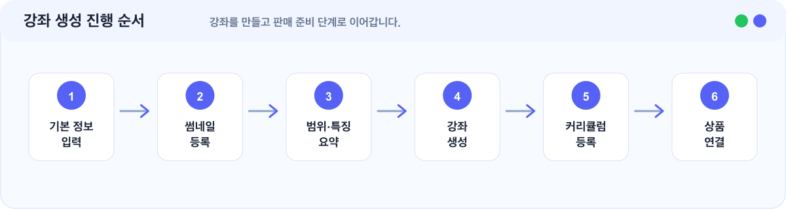

# 강좌 생성 가이드

> 수강생이 실제로 학습할 강좌의 기본 정보를 입력합니다.


강좌는 콘텐츠 단위입니다. 수강생에게 판매하려면 강좌 생성 후 반드시 수강 상품에 연결해야 합니다.


## 이런 경우에 보세요

| 상황 | 이 문서에서 확인할 내용 |
| --- | --- |
| 첫 강좌를 만들고 싶습니다. | 강좌 기본 정보 입력 순서 |
| 강좌 제목, 설명, 썸네일을 어떻게 넣어야 할지 모르겠습니다. | 제목과 설명 작성 기준 |
| 강좌를 만들었는데 판매 화면에 보이지 않습니다. | 상품 연결이 필요한 이유 |

## 한눈에 보기

<figure></figure>

## 시작 전 준비

| 준비 항목 | 설명 |
| --- | --- |
| 강좌 제목 | 수강생이 가장 먼저 보는 이름입니다. |
| 썸네일 이미지 | 강좌 목록과 상품 화면에 보이는 대표 이미지입니다. |
| 강좌 범위 | 이 강좌에서 다루는 학습 범위입니다. |
| 내용 및 특징 | 수업 방식과 강좌의 장점을 설명합니다. |
| 강좌 요약 | 구매 전 빠르게 확인할 짧은 설명입니다. |
| 강의 영상 | 생성 후 커리큘럼 단계에서 연결합니다. |

## 1. 강좌 제목 작성하기

좋은 제목은 대상, 과목, 결과가 드러납니다.

| 좋은 예 | 이유 |
| --- | --- |
| 중등 수학 1학기 개념 완성 | 대상과 목표가 명확합니다. |
| 고등 수학 상 대표 유형 문제 풀이 | 과목과 수업 방식이 보입니다. |
| 초등 5학년 연산 실수 줄이기 | 수강 후 기대 효과가 보입니다. |

아쉬운 예:

| 아쉬운 예 | 이유 |
| --- | --- |
| 수학 강의 | 대상과 결과가 드러나지 않습니다. |
| 개념 강좌 | 어떤 개념인지 알기 어렵습니다. |
| 문제 풀이 | 과목과 수업 범위가 보이지 않습니다. |

## 2. 강좌 썸네일 등록하기

썸네일은 강좌 목록과 상품 화면에서 수강생의 첫인상을 결정합니다.

확인할 것:

| 확인 항목 | 기준 |
| --- | --- |
| 이미지 적합성 | 강좌 주제와 어울립니다. |
| 모바일 가독성 | 중요한 내용이 잘 보입니다. |
| 문구 밀도 | 너무 많은 글자가 들어가지 않았습니다. |

## 3. 강좌 범위 입력하기

강좌 범위에는 이 강좌에서 다루는 학습 범위를 적습니다.

예시:

| 예시 | 의미 |
| --- | --- |
| 중학교 1학년 1학기 핵심 개념 | 학년과 범위가 명확합니다. |
| 고등 수학 상 다항식과 방정식 | 과목과 단원이 보입니다. |
| 초등 5학년 연산과 분수 기초 | 대상과 주제가 드러납니다. |

## 4. 내용 및 특징 입력하기

내용 및 특징에는 이 강좌가 어떤 방식으로 진행되는지 적습니다.

예시:

| 예시 | 강조점 |
| --- | --- |
| 개념 설명과 대표 유형 풀이를 함께 다룹니다. | 구성 방식 |
| 짧은 강의로 구성되어 혼자서도 따라가기 쉽습니다. | 학습 편의성 |
| 실수하기 쉬운 문제를 중심으로 반복 연습합니다. | 차별점 |

## 5. 강좌 요약 입력하기

강좌 요약은 수강생이 구매 전 빠르게 확인하는 설명입니다.

포함하면 좋은 내용:

| 포함할 내용 | 예시 방향 |
| --- | --- |
| 수강 대상 | 누구에게 필요한 강좌인지 |
| 학습 내용 | 어떤 내용을 배우는지 |
| 기대 효과 | 수강 후 어떤 도움이 되는지 |

## 완료 후 확인

| 항목 | 확인 |
| --- | --- |
| 강좌 생성 | 관리자 강좌 목록에 생성한 강좌가 보입니다. |
| 기본 정보 | 제목, 썸네일, 범위, 특징, 요약이 입력되어 있습니다. |
| 커리큘럼 | 다음 단계에서 섹션과 강의를 등록할 수 있습니다. |
| 판매 연결 | 수강 상품에 강좌를 연결해야 수강생이 구매할 수 있습니다. |

## 다음 단계

강좌를 만든 뒤에는 아래 작업을 이어서 진행합니다.

1. [커리큘럼·영상 업로드 가이드](./커리큘럼-영상-업로드-가이드.md)를 보고 섹션과 강의를 등록합니다.
2. [수강 상품 생성 가이드](./수강-상품-생성-가이드.md)를 보고 상품을 만들고 강좌를 연결합니다.

## 자주 막히는 부분

| 상황 | 확인할 것 |
| --- | --- |
| 강좌를 만들었는데 수강생 사이트에 보이지 않아요 | 강좌만 생성한 상태일 수 있습니다. 수강 상품을 만들고 해당 강좌를 연결한 뒤 상품 상태를 운영중으로 변경해 주세요. |
| 강좌 정보는 나중에 수정할 수 있나요 | 수정할 수 있습니다. 다만 이미 판매 중인 강좌라면 제목, 설명, 썸네일 변경은 신중하게 진행해 주세요. |
| 강좌를 삭제하면 기존 수강생은 어떻게 되나요 | 기존 수강생의 수강 가능 여부는 수강권과 수강 기간을 기준으로 결정됩니다. |
