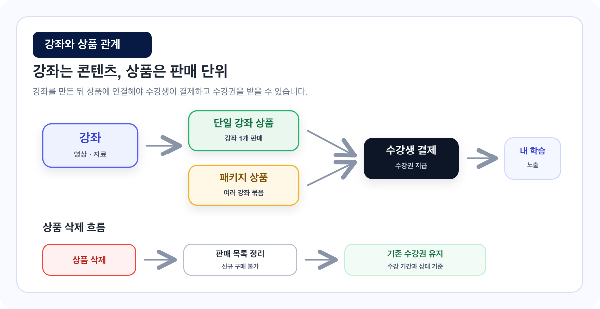

# 강좌와 상품 만들기

클킷에서 강좌와 상품은 서로 다른 개념입니다.

강좌는 수강생이 실제로 듣는 콘텐츠이고, 상품은 수강생이 결제하는 판매 단위입니다.

<figure></figure>

## 이런 경우에 보세요

| 상황 | 보면 좋은 부분 |
| --- | --- |
| 강좌를 만들었는데 판매 화면에 보이지 않습니다. | 상품을 만들어 강좌를 연결합니다 |
| 강좌와 상품의 차이가 헷갈립니다. | 핵심 개념 |
| 단일 강좌 상품을 만들고 싶습니다. | 단일 강좌 상품 |
| 여러 강좌를 묶은 패키지 상품을 만들고 싶습니다. | 패키지 상품 |

## 핵심 개념

| 구분 | 의미 | 예시 |
| --- | --- | --- |
| 강좌 | 수강생이 실제로 듣는 콘텐츠 | 중등 수학 개념 완성 |
| 상품 | 수강생이 구매하는 판매 단위 | 중등 수학 90일 수강권 |

예를 들어 `중등 수학 개념 완성`이라는 강좌 하나를 아래처럼 여러 상품으로 판매할 수 있습니다.

| 판매 방식 | 상품 예시 |
| --- | --- |
| 짧은 기간 체험형 | 중등 수학 30일 수강권 |
| 기본 판매형 | 중등 수학 90일 수강권 |
| 묶음 판매형 | 중등 수학 + 문제풀이 패키지 |

## 강좌를 먼저 만듭니다

강좌에는 수강생이 실제로 볼 콘텐츠 정보를 입력합니다.

| 필요한 정보 | 설명 |
| --- | --- |
| 강좌 제목 | 수강생에게 노출되는 강좌 이름 |
| 강좌 썸네일 | 목록과 상세 화면에 보이는 대표 이미지 |
| 강좌 범위 | 수강 대상이나 학습 범위 |
| 내용 및 특징 | 강좌의 핵심 장점 |
| 강좌 요약 | 강좌 상세에서 보여줄 짧은 설명 |
| 커리큘럼 | 섹션과 강의 구성 |
| 강의 영상 | 실제 학습 콘텐츠 |

자세한 내용은 [강좌 생성 가이드](./강좌-생성-가이드.md)를 확인해 주세요.

## 커리큘럼과 영상을 등록합니다

강좌를 만들었다면 섹션과 강의를 구성하고, 각 강의에 영상을 연결합니다.

| 순서 | 작업 |
| --- | --- |
| 1 | 섹션 생성 |
| 2 | 강의 생성 |
| 3 | 영상 업로드 |
| 4 | 강의 순서 확인 |
| 5 | 미리보기 여부 설정 |

자세한 내용은 [커리큘럼·영상 업로드 가이드](./커리큘럼-영상-업로드-가이드.md)를 확인해 주세요.

## 상품을 만들어 강좌를 연결합니다

상품은 수강생이 실제로 결제하는 단위입니다.

| 상품 정보 | 설명 |
| --- | --- |
| 상품명 | 구매 화면에 노출되는 이름 |
| 상품 설명 | 상품 상세 설명 |
| 연결할 강좌 | 구매 시 수강권이 지급될 강좌 |
| 판매 금액 | 수강생이 결제할 금액 |
| 할인 정보 | 정가 대비 할인 방식과 금액 |
| 수강 기간 | 구매 후 수강 가능한 기간 |
| 상품 상태 | 운영중 또는 운영중지 |

상품을 운영중으로 설정하면 수강생이 구매할 수 있습니다.

자세한 내용은 [수강 상품 생성 가이드](./수강-상품-생성-가이드.md)를 확인해 주세요.

## 단일 강좌 상품

강좌 1개를 판매하는 상품입니다. 처음 판매를 시작할 때는 단일 강좌 상품을 추천합니다.

| 항목 | 예시 |
| --- | --- |
| 상품명 | 중등 수학 90일 수강권 |
| 연결 강좌 | 중등 수학 개념 완성 |
| 수강 기간 | 90일 |
| 판매 금액 | 70,000원 |

## 패키지 상품

여러 강좌를 묶어서 판매하는 상품입니다.

| 항목 | 예시 |
| --- | --- |
| 상품명 | 중등 수학 전체 패키지 |
| 연결 강좌 | 개념 강좌, 문제풀이 강좌, 실전 모의고사 강좌 |
| 수강 기간 | 180일 |
| 판매 금액 | 180,000원 |

패키지 상품은 여러 강좌를 한 번에 판매하고 싶을 때 사용합니다.

## 상품 상태 이해하기

| 상태 | 의미 | 기존 수강생 |
| --- | --- | --- |
| 운영중 | 수강생이 상품을 구매할 수 있는 상태 | 수강 가능 |
| 운영중지 | 신규 판매가 중단된 상태 | 수강 기간이 남아 있으면 수강 가능 |
| 삭제 | 신규 판매와 관리자 목록에서 정리 | 기존 수강권은 기간과 상태 기준으로 유지 |


상품 삭제는 판매 상품을 정리하는 동작입니다. 기존 구매 수강생의 수강권은 바로 삭제되지 않습니다.


## 자주 막히는 부분

### 강좌를 만들었는데 사이트에 안 보여요.

강좌만 만들면 판매 화면에 바로 보이지 않을 수 있습니다. 수강 상품을 만들고 강좌를 연결한 뒤, 상품 상태를 운영중으로 변경해 주세요.

### 상품을 운영중지하면 기존 수강생도 못 듣나요?

아닙니다. 운영중지는 신규 판매를 중단하는 상태입니다. 기존 구매 수강생은 수강 기간이 남아 있다면 계속 수강할 수 있습니다.

### 상품을 여러 개 만들어도 되나요?

가능합니다. 같은 강좌를 30일 상품, 90일 상품처럼 여러 방식으로 판매할 수 있습니다.

### 패키지 상품에서 강좌를 삭제하면 어떻게 되나요?

패키지 구성에서 강좌가 제외될 수 있습니다. 이미 구매한 수강생의 수강권은 별도 정책에 따라 유지될 수 있으므로 삭제 전 연결 상태를 확인해 주세요.
