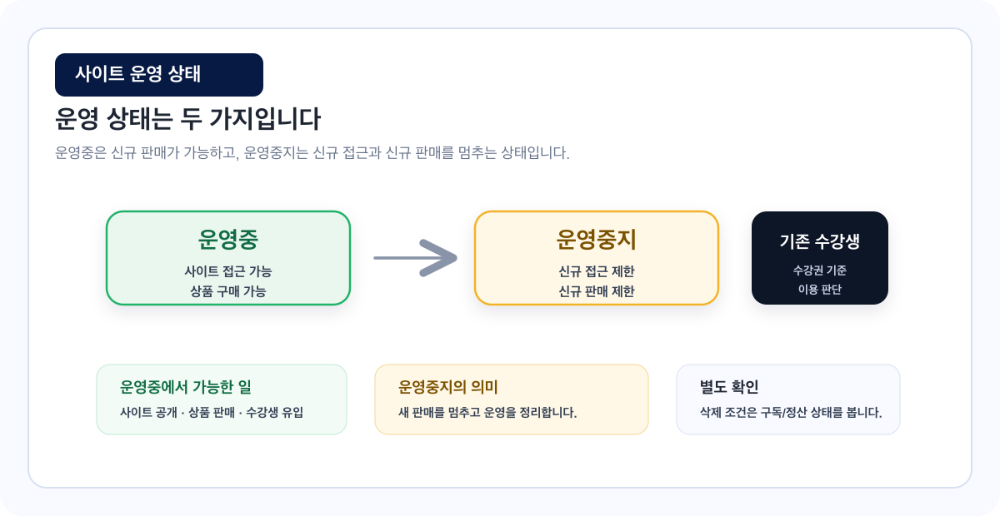
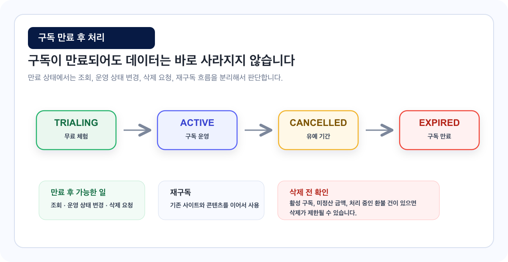

# 사이트 운영 상태 가이드

사이트 운영 상태는 수강생이 강의 사이트에 접근할 수 있는지, 상품을 구매할 수 있는지에 영향을 줍니다.

## 이런 경우에 보세요

| 상황 | 보면 좋은 부분 |
| --- | --- |
| 사이트를 공개하거나 운영을 잠시 멈추고 싶습니다. | 운영중, 운영중지 |
| 구독이 만료되었을 때 어떤 작업이 가능한지 궁금합니다. | 구독 만료 |
| 사이트 삭제 가능 조건을 알고 싶습니다. | 사이트 삭제 |

## 운영중

사이트가 정상 운영되는 상태입니다.

수강생은 사이트에 접근하고, 운영중인 상품을 확인하고, 구매할 수 있습니다.

## 운영중지

사이트 운영을 멈춘 상태입니다.

신규 수강생 접근이나 구매가 제한될 수 있습니다. 기존 구매 수강생의 이용 가능 여부는 수강 기간과 사이트 정책에 따라 달라질 수 있습니다.

## 구독 만료

무료체험 또는 유료 구독이 종료되면 구독 만료 상태가 될 수 있습니다.

구독이 만료되어도 사이트와 콘텐츠가 바로 삭제되는 것은 아닙니다.

| 구분 | 작업 |
| --- | --- |
| 가능할 수 있는 작업 | 사이트 정보 조회, 사이트 운영 상태 변경, 사이트 삭제 요청, 플랜 선택 후 재구독 |
| 제한될 수 있는 작업 | 신규 판매, 일부 관리자 기능, 구독 플랜이 필요한 기능 |

## 사이트 삭제

사이트 삭제는 운영 상태와 구독 상태, 정산/환불 상태에 따라 제한될 수 있습니다.

| 삭제 전 확인 항목 | 이유 |
| --- | --- |
| 진행 중인 구독이 없는지 | 활성 구독이 있으면 삭제가 제한될 수 있습니다. |
| 미정산 금액이 없는지 | 정산이 남아 있으면 삭제 전에 처리가 필요합니다. |
| 처리 중인 환불 건이 없는지 | 환불 처리가 끝나야 정산과 삭제 판단이 명확해집니다. |
| 기존 수강생 안내가 완료되었는지 | 운영 중단이나 삭제 전 사용자 혼선을 줄입니다. |


만료된 사이트는 정책상 삭제할 수 있어야 합니다. 다만 미정산, 환불, 활성 구독 같은 별도 제한 조건이 있으면 삭제가 막힐 수 있습니다.


## 자주 막히는 부분

### 구독이 만료되면 사이트가 바로 삭제되나요?

아닙니다. 구독이 만료되어도 사이트와 콘텐츠는 일정 기간 유지됩니다. 다시 구독하면 기존 데이터를 이어서 사용할 수 있습니다.

### 만료 상태에서도 삭제할 수 있나요?

정책상 만료된 사이트는 삭제가 가능해야 합니다. 다만 미정산, 환불, 구독 상태 등 다른 제한 조건이 있다면 삭제가 막힐 수 있습니다.

### 운영중지하면 기존 수강생도 접근할 수 없나요?

운영중지는 신규 운영을 멈추는 의미가 큽니다. 기존 구매 수강생의 접근은 수강권과 수강 기간, 사이트 정책을 기준으로 처리됩니다.
