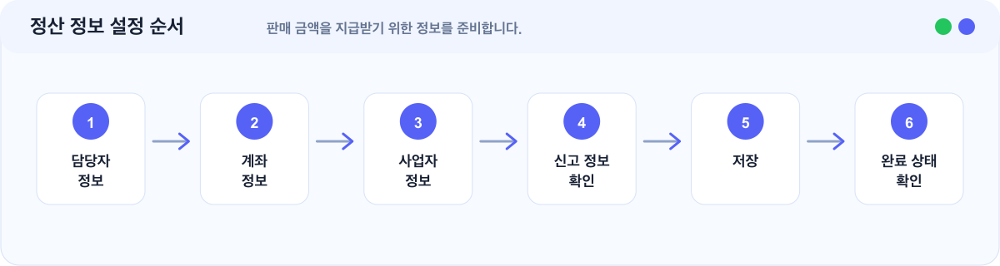

# 정산 정보 설정 가이드

> 판매 금액을 정산받기 위해 필요한 정보를 입력합니다.


정산 정보는 수강생에게 직접 보이는 정보는 아니지만, 실제 판매와 정산을 안정적으로 진행하기 위해 판매 전 입력하는 것을 권장합니다.


## 이런 경우에 보세요

| 상황 | 이 문서에서 확인할 내용 |
| --- | --- |
| 강의를 판매하기 전 정산 정보를 입력하고 싶습니다. | 정산 정보 입력 순서 |
| 어떤 정보가 필요한지 궁금합니다. | 담당자, 계좌, 사업자 정보 |
| 사업자 정보나 계좌 정보를 어디까지 입력해야 하는지 모르겠습니다. | 항목별 확인 기준 |

## 한눈에 보기

<figure></figure>

## 필요한 정보

| 정보 | 설명 |
| --- | --- |
| 정산 담당자 정보 | 정산 관련 안내를 받을 담당자 정보입니다. |
| 정산 계좌 정보 | 판매 금액을 지급받을 계좌 정보입니다. |
| 사업자 정보 | 사업자로 운영하는 경우 필요한 정보입니다. |
| 통신판매업 신고 정보 | 온라인 판매 운영 형태에 따라 필요할 수 있습니다. |
| 원격교습학원 정보 | 교육 콘텐츠 판매 형태에 따라 필요할 수 있습니다. |

운영 형태에 따라 필요한 항목이 달라질 수 있습니다.

## 1. 정산 담당자 정보 입력하기

정산 관련 안내를 받을 담당자 정보를 입력합니다.

확인할 것:

| 확인 항목 | 기준 |
| --- | --- |
| 이름 | 정산 안내를 받을 담당자 이름 |
| 연락처 | 확인 가능한 연락처 |
| 이메일 | 정산 안내를 받을 이메일 |

정산이나 결제 확인이 필요할 때 연락 가능한 정보로 입력해 주세요.

## 2. 정산 계좌 정보 입력하기

판매 금액을 지급받을 계좌 정보를 입력합니다.

확인할 것:

| 확인 항목 | 기준 |
| --- | --- |
| 은행명 | 실제 지급받을 계좌의 은행 |
| 계좌번호 | 오타 없이 입력된 번호 |
| 예금주 | 실제 계좌 예금주 |


계좌번호와 예금주가 실제 정보와 다르면 정산이 지연될 수 있습니다.


## 3. 사업자 정보 입력하기

사업자로 운영하는 경우 사업자 정보를 입력합니다.

확인할 것:

| 확인 항목 | 기준 |
| --- | --- |
| 사업자등록번호 | 실제 사업자등록번호 |
| 상호명 | 등록된 상호명 |
| 대표자명 | 사업자 대표자명 |
| 사업장 주소 | 사업자 정보와 일치하는 주소 |

## 4. 통신판매업 신고 정보 확인하기

온라인으로 상품을 판매하는 경우 통신판매업 신고 정보가 필요할 수 있습니다.

본인의 운영 형태에 따라 필요한 정보인지 확인해 주세요.

## 5. 원격교습학원 정보 확인하기

교육 콘텐츠 판매 형태에 따라 원격교습학원 관련 정보가 필요할 수 있습니다.

필요 여부가 불확실하다면 관련 법령이나 담당 기관을 확인하거나 고객지원으로 문의해 주세요.

## 완료 후 확인

| 항목 | 확인 |
| --- | --- |
| 계좌번호 | 정확하게 입력되어 있습니다. |
| 예금주 | 실제 계좌 예금주와 일치합니다. |
| 사업자 정보 | 실제 판매자 정보와 일치합니다. |
| 필수 항목 | 필요한 필수 항목이 모두 입력되어 있습니다. |
| 관리자 상태 | 정산 설정이 완료 상태로 표시됩니다. |

## 자주 막히는 부분

| 상황 | 확인할 것 |
| --- | --- |
| 정산 정보를 나중에 입력해도 되나요 | 사이트와 강좌를 먼저 준비하는 것은 가능합니다. 다만 실제 판매와 정산을 안정적으로 진행하려면 판매 전 입력하는 것이 좋습니다. |
| 개인 강사도 정산 정보를 입력해야 하나요 | 판매 대금을 지급받기 위해 필요한 정보는 입력해야 합니다. 운영 형태에 따라 필요한 항목이 달라질 수 있습니다. |
| 정보를 잘못 입력하면 어떻게 되나요 | 정산 지연이나 확인 절차가 발생할 수 있습니다. 판매 전 정확하게 입력했는지 확인해 주세요. |

## 다음에 보면 좋은 문서

| 문서 | 언제 보면 좋나요 |
| --- | --- |
| [결제·정산 준비하기](./결제-정산-준비하기.md) | 결제부터 정산까지 전체 흐름을 확인할 때 |
| [수강 상품 생성 가이드](./수강-상품-생성-가이드.md) | 판매 상품을 만들고 정산 준비를 이어갈 때 |
